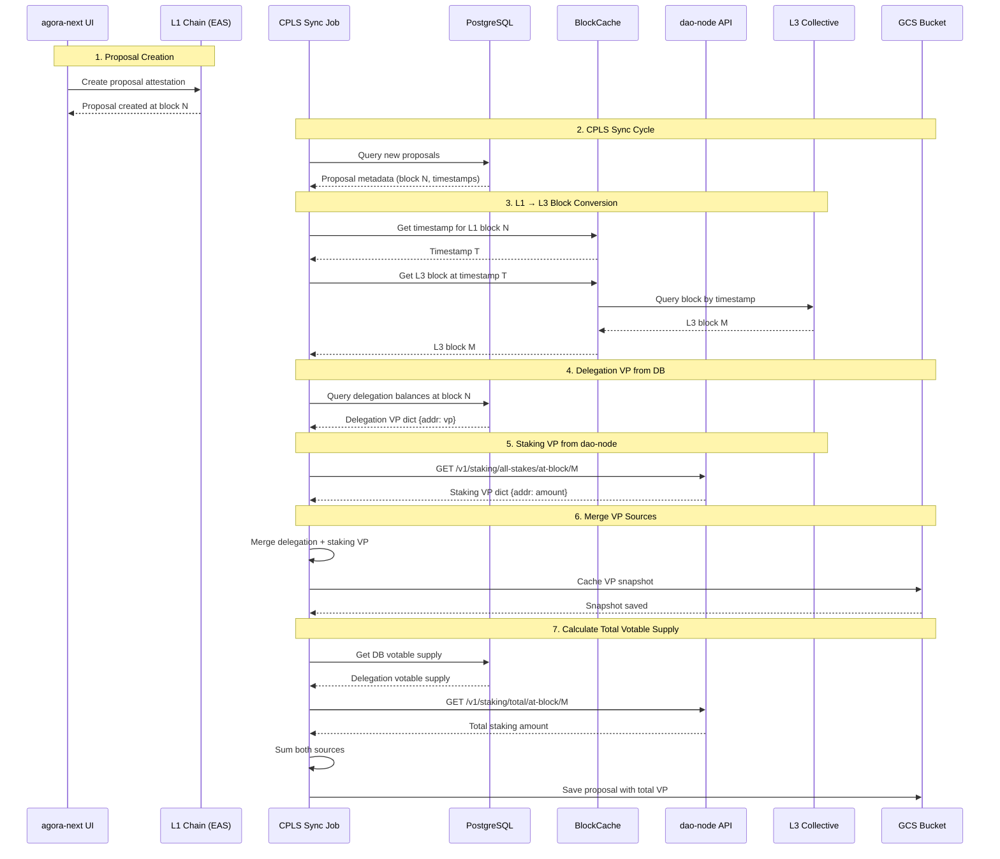
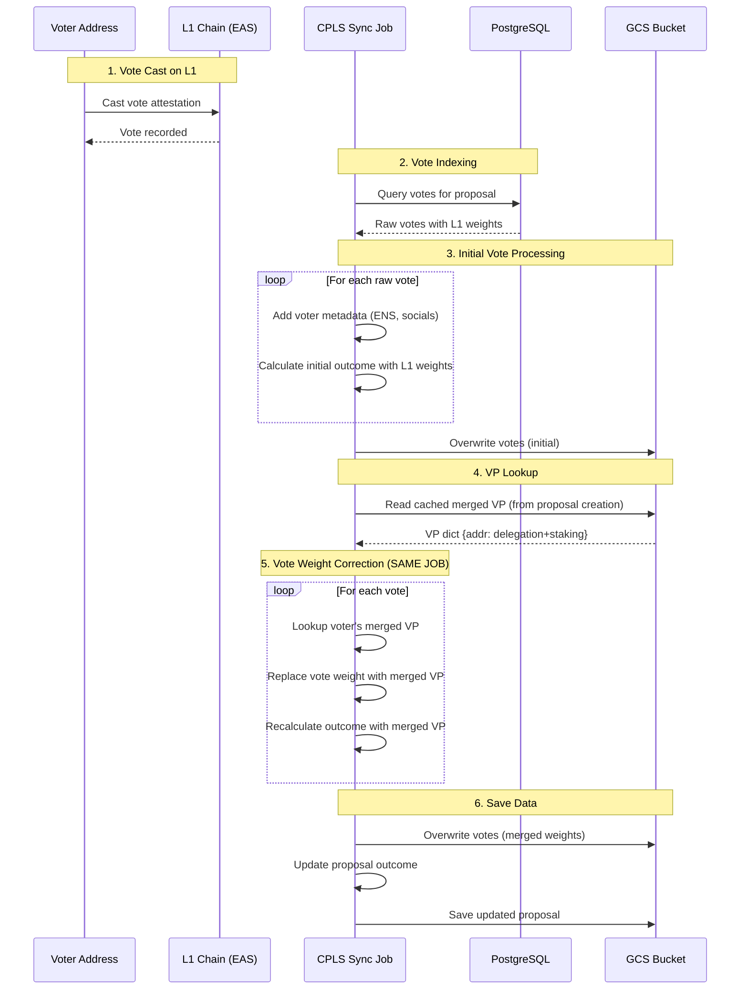
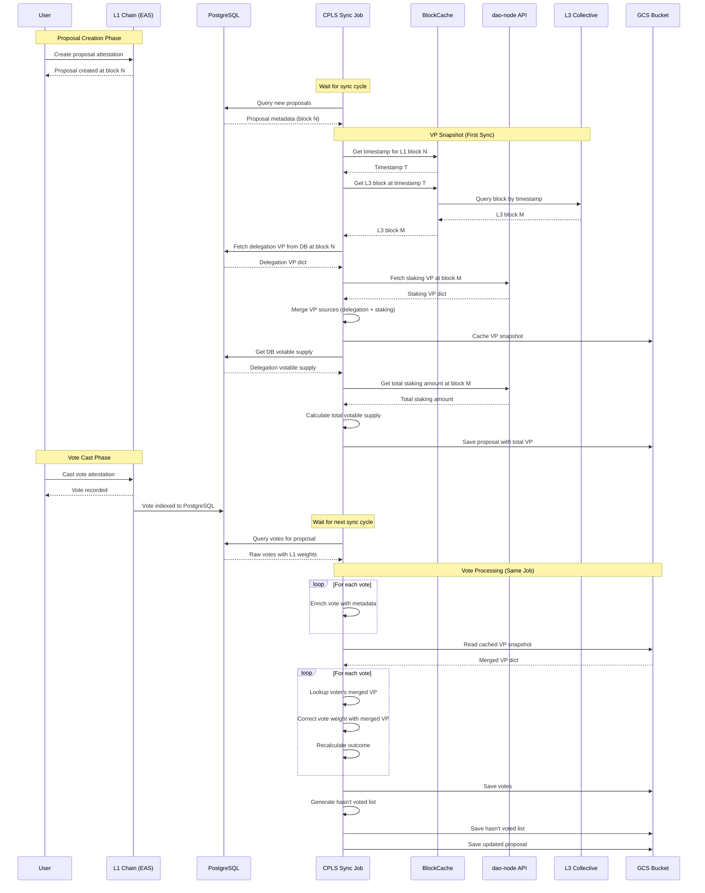

# Syndicate L3 Collective Staking Integration Architecture

## Overview

This document describes the architecture for integrating L3 Collective staking into the Syndicate governance system. The integration allows users who have staked tokens on the L3 Collective chain to participate in governance with their staked balances, in addition to their delegated tokens on L1.

### Key Features

- **Dual Voting Power**: Combines both L1 delegation and L3 staking balances
- **Cross-Chain Integration**: Synchronizes vote power across L1 and L3 (L3 Collective)
- **Point-in-Time Snapshots**: Captures voting power at proposal creation time
- **Votable Supply Enhancement**: Includes staking balances in total votable supply calculations
- **Transparent Aggregation**: Delegates can have delegation-only, staking-only, or both types of voting power

## Data Flow

### Proposal Creation and VP Snapshot Flow

### Vote Casting and Outcome Calculation Flow

**Key Timing Details**:

- **No delay between correction and vote**: Both happen in the same atomic job execution
- **VP Snapshot is cached**: Created once when proposal starts, reused for all vote corrections

### Complete Lifecycle Timeline

**Key Observations**:

1. **VP Snapshot Created Once**: When proposal starts, the VP snapshot (delegation + staking) is calculated and cached. This same snapshot is reused for all votes.

2. **Correction is Atomic**: The vote weight correction happens in the same job as vote ingestion. There's never a window where users see incorrect vote weights (if they do, it's only during job processing).
